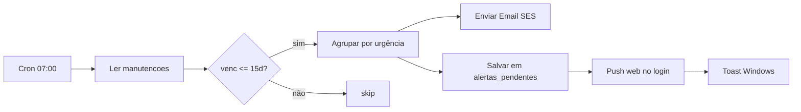
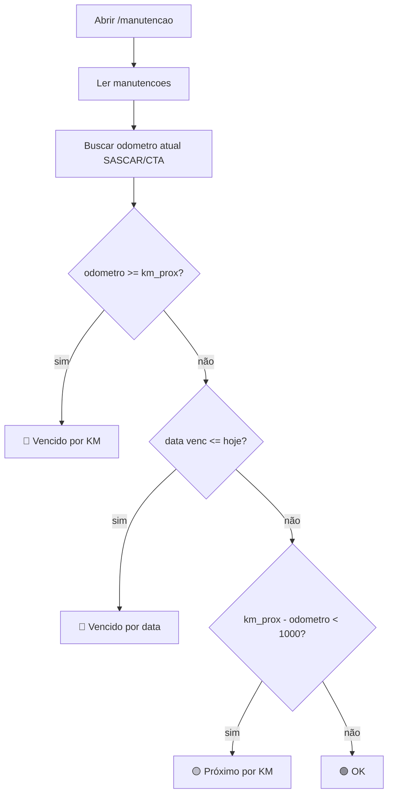
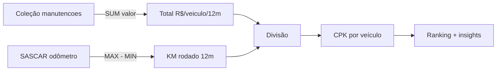
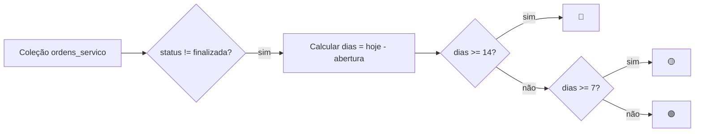
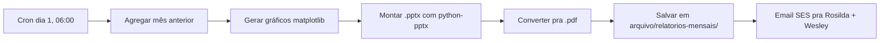

# 🔧 Planejamento — Features novas do módulo de Manutenção

> Desenho detalhado do que cada feature vai fazer, ANTES de implementar.
> Revisar e aprovar/ajustar cada uma antes do dev.

**Criado:** 2026-07-21 · **Contexto:** Sessão pergunta "o que mais preciso pro sistema de manutenção?"

---

## 1️⃣ Alerta automático de vencimentos (Email + Toast + Push)

### O que faz
Todo dia às 07:00 (Cloud Function scheduled), o sistema:
1. Varre coleção `manutencoes` procurando itens com `venc <= hoje + 15 dias`
2. Agrupa por urgência: 🔴 vencidos · 🟡 <7 dias · 🟢 8-15 dias
3. Dispara pra você via:
   - **Email diário** (resumo consolidado, 1 msg)
   - **Push notification** no Chrome/Edge (imediato quando abre sistema)
   - **Toast Windows** (só no seu PC, imediato via hook já existente)

### Wireframe do email
```
━━━━━━━━━━━━━━━━━━━━━━━━━━━━━━━━━━━━━━━━━━━━━━━━━━━━━━
📅 Pontual Logística — Vencimentos 21/07/2026
━━━━━━━━━━━━━━━━━━━━━━━━━━━━━━━━━━━━━━━━━━━━━━━━━━━━━━

🔴 VENCIDOS (3)
  · CRLV SEF1H27-2 — venceu há 5 dias
  · CIV SFL4G42-1 — venceu ontem
  · CNH ABRAIR SANTOS — venceu há 2 dias

🟡 VENCE EM ATÉ 7 DIAS (5)
  · Tacógrafo SES9I57-3 — 24/07 (3d)
  · Extintor BBE9588-3 — 26/07 (5d)
  · ASO FLORIANO PEREIRA — 27/07 (6d)
  ...

🟢 VENCE EM 8-15 DIAS (12)
  · Óleo SFL4G87-2 — 03/08 (13d)
  ...

Abrir sistema: https://localhost:5175/manutencao?aba=alertas
━━━━━━━━━━━━━━━━━━━━━━━━━━━━━━━━━━━━━━━━━━━━━━━━━━━━━━
```

### Fluxo


### User story
> Como gestora de frota, quero receber 1 email diário resumindo vencimentos, pra nunca deixar CRLV/CIV vencer e evitar multas de R$ 293-1467.

### Custo · Tempo dev
R$ 0-5/mês · 4-6h

---

## 2️⃣ Manutenção por KM (não só por data)

### O que faz
Cada tipo de manutenção mecânica ganha campo **km_prox** além de `venc` (data):
- **Óleo:** vence em 90 dias OU 20.000km — o que vier primeiro
- **Pneus:** vence quando rodar +80.000km desde a última troca
- **Freios:** 40.000km ou 6 meses

O sistema cruza odômetro atual (SASCAR/CTA) com `km_prox`. Se `odometro_atual >= km_prox`, marca como vencido mesmo se a data ainda não chegou.

### Wireframe (tela AbaControleRotina)
```
┌─────────────────────────────────────────────────────────────┐
│ SEF1H27-2 · ABRAIR SANTOS                                   │
├─────────────────────────────────────────────────────────────┤
│ 🔧 Troca de Óleo                                            │
│   Última: 03/05/2026 · KM: 315.827                          │
│   Próxima: 03/08/2026 OU 335.827 km                         │
│   ↳ HOJE: KM atual 335.912 → 🔴 VENCEU POR KM (+85 km)      │
│                                                             │
│ 🛞 Pneus                                                    │
│   Última: 12/06/2026 · KM: 320.100                          │
│   Próxima: 12/12/2026 OU 400.100 km                         │
│   ↳ HOJE: KM atual 335.912 → 🟢 OK (faltam 64.188 km)       │
└─────────────────────────────────────────────────────────────┘
```

### Fluxo


### User story
> Como gestora, quero que o sistema me avise antes de estourar o KM de troca de óleo, pra evitar quebra de motor (custo médio R$ 15-25k).

### Custo · Tempo dev
R$ 0 · 8-12h

---

## 3️⃣ CPK real — Custo Por Km rodado

### O que faz
Cada veículo ganha painel financeiro:
- Total gasto em manutenção (últimos 12 meses)
- KM rodado no mesmo período (SASCAR odômetro inicial vs final)
- **CPK = Total R$ / Total km**
- Ranking dos veículos por CPK — quem custa mais

### Wireframe (nova aba `/manutencao?aba=cpk`)
```
┌─────────────────────────────────────────────────────────────┐
│ CUSTO POR KM · Últimos 12 meses                    [Filtro] │
├────────────┬────────┬──────────┬──────────┬─────────┬───────┤
│ Placa      │ KM     │ R$ Total │ R$/km    │ Rank    │ 12m   │
├────────────┼────────┼──────────┼──────────┼─────────┼───────┤
│ SFL4G42-1  │142.310 │ 87.240   │ 0,613    │ 🔴 #1   │ 📈+22%│
│ SEF1H27-2  │128.500 │ 52.180   │ 0,406    │ 🟡 #8   │ →±3%  │
│ AKD5988-2  │ 98.700 │ 22.450   │ 0,227    │ 🟢 #37  │ 📉-15%│
│ ...                                                          │
├────────────┴────────┴──────────┴──────────┴─────────┴───────┤
│ Média frota: R$ 0,384/km  · Meta: R$ 0,350/km  · Δ +9,7%    │
└─────────────────────────────────────────────────────────────┘

💡 Insights automáticos:
  • SFL4G42-1 tá 60% acima da média — avaliar substituição
  • AKD5988-2 tá muito abaixo — manter modelo em compras futuras
```

### Fluxo


### User story
> Como Wesley/Rosilda, quero saber quais caminhões custam mais por km, pra decidir substituir/vender os mais caros e negociar melhor peça de reposição.

### Custo · Tempo dev
R$ 0 · 6-10h

---

## 4️⃣ Aging de OS abertas

### O que faz
Nova coluna na lista de OS mostrando **quantos dias tá aberta**. Ordena por mais tempo aberto. OS com >7 dias fica vermelha. Motivo: OS eterna esconde peça encalhada + mecânico esquecendo.

### Wireframe (aba OS)
```
┌───────────────────────────────────────────────────────────────┐
│ Ordens de Serviço · Abertas (14)              [Filtrar ▼]     │
├──────┬────────────┬───────────────┬─────────┬─────────┬────────┤
│ #OS  │ Aberto há  │ Placa         │ Serviço │ Valor   │ Resp.  │
├──────┼────────────┼───────────────┼─────────┼─────────┼────────┤
│ 0847 │ 🔴 22 dias │ SFL4G42-1     │ Embreag │ 4.200   │ Rafael │
│ 0851 │ 🔴 14 dias │ SEF1H27-2     │ Freios  │ 1.850   │ Rafael │
│ 0865 │ 🟡  8 dias │ AKD5988-2     │ Óleo    │   320   │ Karine │
│ 0872 │ 🟢  2 dias │ TBX5H17-2     │ Pneu    │ 2.100   │ Rafael │
├──────┴────────────┴───────────────┴─────────┴─────────┴────────┤
│ ⚠ 2 OS com >14 dias — Rafael responsável                       │
└───────────────────────────────────────────────────────────────┘
```

### Fluxo


### User story
> Como gestora, quero ver quais OS tão eternas pra cobrar o mecânico e liberar caminhão do bloqueio de manutenção.

### Custo · Tempo dev
R$ 0 · 2-3h

---

## 5️⃣ Relatório mensal automático PPT/PDF

### O que faz
Todo dia 1 do mês, cron gera arquivo `.pptx` e `.pdf` com:
- Resumo executivo do mês anterior
- Gráficos: gasto por categoria, top 5 veículos + custosos, evolução mensal
- Vencimentos que se aproximam
- OS abertas há muito tempo
- KPIs: disponibilidade, MTBF, MTTR
- Salvo em `arquivo/relatorios-mensais/2026-08.pptx` + enviado por email pra ela

### Wireframe do PPT (slides)
```
Slide 1: CAPA          — "Manutenção Frota · Julho 2026"
Slide 2: KPIs          — 4 números grandes: disponibilidade %, MTTR, MTBF, R$ total
Slide 3: Gráfico       — Gasto por categoria (donut: mecânica, docs, pneus)
Slide 4: Top 5 CPK     — barras horizontais dos + custosos
Slide 5: Vencimentos   — próximos 30 dias, agrupados por urgência
Slide 6: OS abertas    — aging table
Slide 7: Comparativo   — mês vs mês anterior (%)
Slide 8: Recomendações — insights automáticos
```

### Fluxo


### User story
> Como Rosilda, quero receber o relatório mensal pronto pra imprimir ou compartilhar em reunião, sem ter que montar Excel/PPT toda ponta de mês.

### Custo · Tempo dev
R$ 0 · 8-12h

---

## 📊 Resumo executivo pra aprovar

| # | Feature | Valor prático | Custo/mês | Dev | Prioridade |
|---|---|---|---|---|---|
| 1 | Alertas vencimento | ⭐⭐⭐⭐⭐ | R$ 0-5 | 4-6h | 🔴 Alta |
| 2 | Manutenção por KM | ⭐⭐⭐⭐⭐ | R$ 0 | 8-12h | 🔴 Alta |
| 3 | CPK real | ⭐⭐⭐⭐ | R$ 0 | 6-10h | 🟡 Média |
| 4 | Aging OS | ⭐⭐⭐ | R$ 0 | 2-3h | 🟢 Rápida |
| 5 | Relatório mensal | ⭐⭐⭐⭐ | R$ 0 | 8-12h | 🟡 Média |

**Total dev estimado:** 28-43h (~1 semana focada)
**Custo total/mês:** R$ 0-5 (só email SES, se passar de 62k msgs/mês)

## 🎯 Ordem sugerida

1. **Aging OS** (2-3h) — quick win, entrega valor no mesmo dia
2. **Alertas email** (4-6h) — evita multa/quebra
3. **Manutenção por KM** (8-12h) — feature crítica, evita quebra de motor
4. **Relatório mensal** (8-12h) — libera tempo dela
5. **CPK real** (6-10h) — decisão estratégica de renovação de frota

---

*Aprovar item por item — cada ✅ inicia a implementação. Pode ajustar wireframes antes de codar.*
